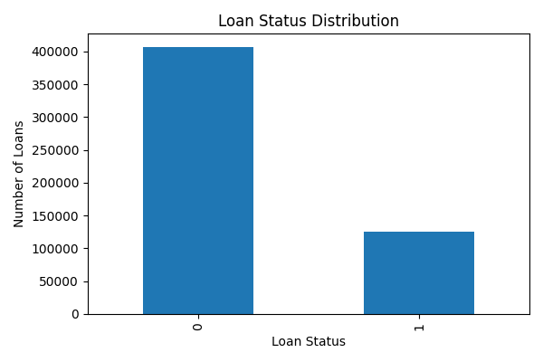
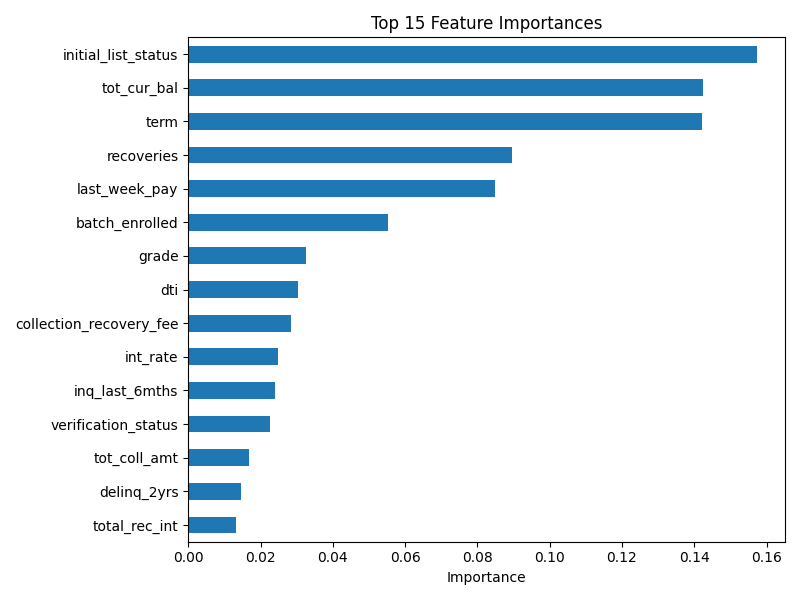
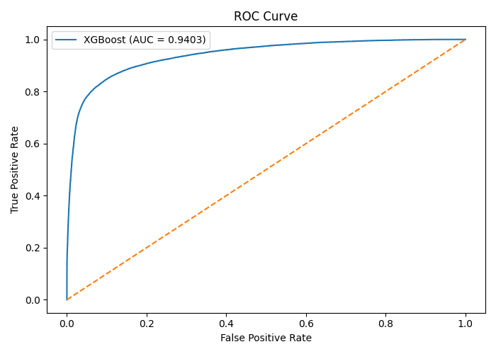

# Loan Default Prediction Using XGBoost

A machine learning project for predicting loan default risk from borrower and loan-level information using **XGBoost**.

The project implements a complete tabular machine learning pipeline including data cleaning, missing-value handling, feature engineering, categorical encoding, model inference, and ROC-AUC evaluation.

## Overview

Loan default prediction is a binary classification problem where the objective is to determine whether a borrower/loan is likely to belong to the positive loan-status class.

This project uses **XGBoost Classifier** to learn patterns from historical loan data and generate a probability score for each loan. The model is evaluated using **ROC-AUC**, achieving a score of **0.9403** on the held-out test set.

### Pipeline

```text
Raw Loan Data
      ↓
Data Cleaning
      ↓
Missing Value Handling
      ↓
Feature Engineering
      ↓
Categorical Encoding
      ↓
Trained XGBoost Model
      ↓
Default Probability
      ↓
ROC-AUC Evaluation
```

## Features

The dataset contains borrower and loan-related attributes such as:

* Loan amount and loan term
* Interest rate
* Employment length
* Annual income
* Loan grade and sub-grade
* Verification information
* Payment history
* Credit-related attributes
* Employment information

## Data Preprocessing

The preprocessing pipeline includes:

* Removing duplicate records
* Removing features with excessive missing values
* Removing identifier and free-text fields
* Converting loan terms into numerical values
* Converting employment length into numerical values
* Extracting numerical information from payment-history fields
* Median imputation for missing numerical values
* Handling missing employment titles
* Converting loan grades and sub-grades into numerical representations
* Encoding categorical variables using `LabelEncoder`

## Model

The project uses **XGBoost (`XGBClassifier`)**, a gradient-boosted decision-tree algorithm well suited for structured/tabular datasets.

The trained model is stored in:

```text
model/final.model
```

The model generates class probabilities using:

```python
model.predict_proba(X)[:, 1]
```

This probability can be interpreted as the model's estimated likelihood of belonging to the positive class.

## Evaluation

The model is evaluated using **ROC-AUC (Receiver Operating Characteristic – Area Under the Curve)**.

### Result

**ROC-AUC: 0.9403**

A ROC-AUC value close to 1 indicates strong discrimination between the two classes.

## Results & Visualizations

### Loan Status Distribution

Shows the distribution of the target variable (`loan_status`) and helps identify class imbalance in the dataset.



### Top 15 Feature Importances

Shows the 15 features that contributed most to the XGBoost model's predictions.



### ROC Curve

The ROC curve evaluates the model's ability to distinguish between the two loan-status classes.

**ROC-AUC: 0.9403**



## Project Structure

```text
loan-default-prediction/
│
├── data/
│   ├── train.csv
│   └── test.csv
├── model/
│   └── final.model
│
├── results/
│   ├── class_distribution.png
│   ├── feature_importance.png
│   └── roc_curve.png
│
├── src/
│   ├── preprocess.py       # Data cleaning and feature engineering
│   ├── train.py            # Model training, evaluation, plots, and saving
│   └── predict.py          # Loading the trained model and making predictions
│
├── requirements.txt        # Python dependencies
├── README.md               # Project documentation
```

## Usage

Place the input dataset in the `data/` directory and ensure the trained model is available in the `model/` directory.

Run:

```bash
python loan_prediction.py
```

The script preprocesses the input data, loads the trained XGBoost model, generates prediction probabilities, and prints the ROC-AUC score.

## Technologies

* Python
* Pandas
* Scikit-learn
* XGBoost
* Matplotlib

## Future Improvements

* Add a proper train/validation/test split
* Add cross-validation
* Perform hyperparameter tuning
* Add ROC and Precision-Recall curves
* Compare XGBoost with Logistic Regression and Random Forest
* Add feature-importance analysis
* Build an interactive interface for loan-risk prediction
* Add model explainability using SHAP
* Deploy the model as an API or web application
